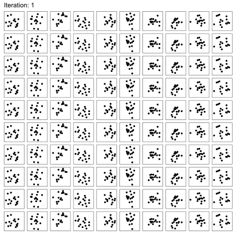
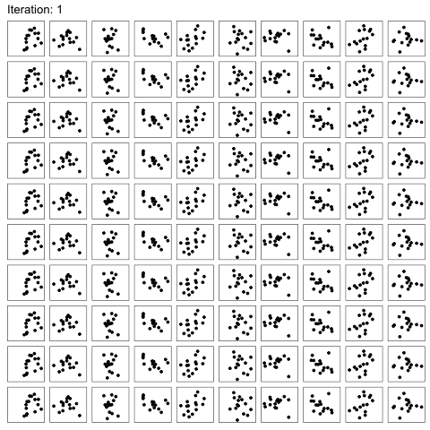
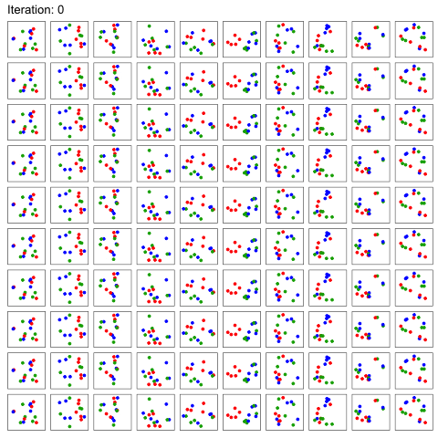

# Serial Reproduction
This is the companion repository for the following article: *Visuospatial Priors Revealed through Serial Reproduction*. The repository contains the scripts and functions needed to reproduce the experiments, analyses and simulations presented in the paper.

## Abstract of the the paper
Working memory is a reconstructive process that requires integrating multiple hierarchical representations of objects. This hierarchical reconstruction allows us to overcome perceptual uncertainty and limited cognitive capacity, but yields systematic biases in working memory as individual items are influenced by the ensemble statistics of the scene, or of their particular group. Given the importance of the hierarchical encoding of a display, we aim to characterize what structured priors people use to encode visual scenes using a nonparametric data-driven approach. In Experiment 1, we examine visuospatial memory’s priors for locations by asking participants to recall the locations of objects in an serial reproduction task. We show that people have priors that bias items toward a more compact structure, and organize them into clustered spatial groups. In Experiment 2, we explicitly introduce discrete color groups, allowing us to test whether the color feature governs the spatial grouping. We find that the spatial structures were color-contingent. By analyzing color groups, we circumvent the grouping uncertainty in Experiment 1 and further reveal spatial priors that compress color groups into collinear structures with similar orientations and equidistant spacing. 

## Serial reproduction paradigm
One participant recall an intial random seed in which 15 dots are randomly distributed across the display. The response was then passed down to a second participant for recall and the process repeats till a serial reproducion is formed.

### Motor experiment: 
Subjects were simply asked to reproduce a pattern of homogenous dots which is available on the side of the response panel throughout the task.

#### The animation of the raw serial reproduction chains:

  

### Memory experiment: 
Subjects were asked to reproduce a pattern of homogenous dots by recalling their positions after 15-second exposure.

#### The animation of the raw serial reproduction chains:

  

### Tricolor memory experiment: 
Subjects were asked to reproduce a pattern of homogenous dots by recalling their positions after 15-second exposure.

#### The animation of the raw serial reproduction chains:

  

